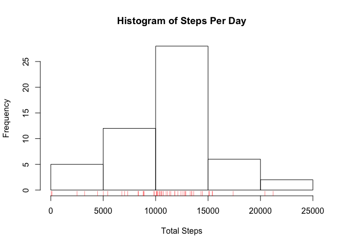
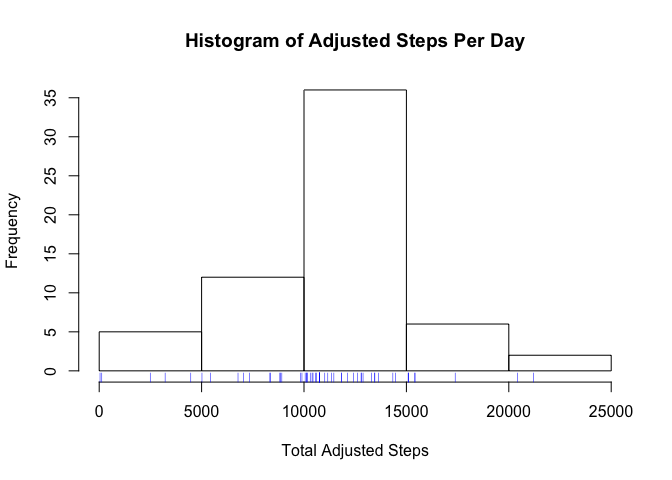
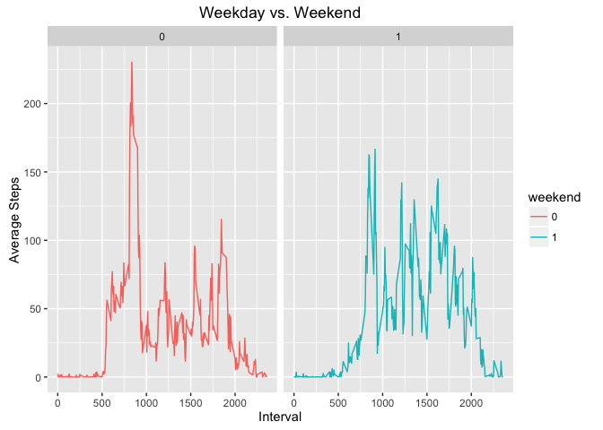

============================================================================

##Reproducible Research - Assignment 1 

============================================================================


The first step is to load and process the data for analysis.


```r
activity <- read.csv("~/Desktop/activityunzipped/activity.csv")
```

Let's take a look at what we have loaded. 


```r
head(activity)
```

```
##   steps       date interval
## 1    NA 2012-10-01        0
## 2    NA 2012-10-01        5
## 3    NA 2012-10-01       10
## 4    NA 2012-10-01       15
## 5    NA 2012-10-01       20
## 6    NA 2012-10-01       25
```

```r
str(activity)
```

```
## 'data.frame':	17568 obs. of  3 variables:
##  $ steps   : int  NA NA NA NA NA NA NA NA NA NA ...
##  $ date    : Factor w/ 61 levels "2012-10-01","2012-10-02",..: 1 1 1 1 1 1 1 1 1 1 ...
##  $ interval: int  0 5 10 15 20 25 30 35 40 45 ...
```

It appears the data variable needs to be reformatted from a factor to a date. I generally use **lubridate** to do date transformations. 


```r
activity$date <- ymd(activity$date)
str(activity)
```

```
## 'data.frame':	17568 obs. of  3 variables:
##  $ steps   : int  NA NA NA NA NA NA NA NA NA NA ...
##  $ date    : Date, format: "2012-10-01" "2012-10-01" ...
##  $ interval: int  0 5 10 15 20 25 30 35 40 45 ...
```

Our date is now formatted correctly. I will use the **dplyr** and **tidyr** packages to do the preprocessing. We'll use the *mutate* and *filter* functions to get a subset of the complete cases. This will be important for our aggregation work later. Finally, we will *select* only the columns date and steps for the first question.


```r
actComplete <- activity %>%
  mutate(valid = ifelse(steps != "NA", 1, 0)) %>%
  filter(valid == 1) %>%
  select(steps, date)
```

Now we should be ready for the first question! 

=================================================================================

####Question 1: What is mean/median total number of steps taken per day?

=================================================================================


First, we need to melt the dataframe into an aggregate dataset by date using the **reshape2** package.


```r
dmelt <- melt(actComplete, id.vars = "date")
```

Next, we need to use **dplyr** and execute the *group_by* and *summarise* functions to get the mean/median of steps by date.


```r
stepsDay <- dmelt %>% 
  group_by(date) %>%
  summarise(mean=mean(value), median=median(value), sum=sum(value))
```

Graph the steps per day histogram.


```r
hist(stepsDay$sum, main = "Histogram of Steps Per Day", xlab = "Total Steps")
rug(stepsDay$sum, col = "red")
```

<!-- -->

Determine the mean and median total steps.


```r
round(mean(stepsDay$sum), 2)
```

```
## [1] 10766.19
```

```r
median(stepsDay$sum)
```

```
## [1] 10765
```

================================================================================

####Question 2: What is the average daily activity pattern?

================================================================================

This question requires a graph that plots the average steps by interval. The first step is to add back the interval variable, and filter out the missing observations.


```r
actInterval <- activity %>%
  mutate(valid = ifelse(steps != "NA", 1, 0)) %>%
  filter(valid == 1) %>%
  select(steps, date, interval)
```

Next, we need to group the data by interval, and then average the steps by each interval.


```r
intervalAvg <- actInterval %>% 
  group_by(interval) %>%
  summarise(avg = mean(steps))
```

Now, we can plot the dataset above.


```r
plot(intervalAvg$interval, intervalAvg$avg, type = "l", xlab = "Interval", ylab = "Average Steps")
```

<!-- -->

Finally, we need to determine the maximum number of steps taken during a 5-minute interval. This is done by subsetting our dataset with a simple max command.


```r
intervalAvg[which(intervalAvg$avg==max(intervalAvg$avg)), ]
```

```
## # A tibble: 1 × 2
##   interval      avg
##      <int>    <dbl>
## 1      835 206.1698
```

===================================================================================

####Question 3: What is the impact of imputing data for the missing observations?

===================================================================================

Determine the number of observations that have NA as its value.


```r
sum(is.na(activity$steps))
```

```
## [1] 2304
```

The easiest form of imputation would be to replace the NA with the mean of the interval from the other days that do not have a missing value. I will round to whole integers for uniformity of the data.


```r
activity2 <- activity %>%
  mutate(step2 = ifelse(is.na(activity$step), intervalAvg$avg, activity$steps)) %>%
  mutate(impSteps = round(step2, 0)) %>%
  select(date, interval, steps, impSteps)
activity3 <- select(activity2, date, impSteps)
```

Now, we will take a look at the data with the imputation applied.


```r
str(activity2)
```

```
## 'data.frame':	17568 obs. of  4 variables:
##  $ date    : Date, format: "2012-10-01" "2012-10-01" ...
##  $ interval: int  0 5 10 15 20 25 30 35 40 45 ...
##  $ steps   : int  NA NA NA NA NA NA NA NA NA NA ...
##  $ impSteps: num  2 0 0 0 0 2 1 1 0 1 ...
```

```r
head(activity2)
```

```
##         date interval steps impSteps
## 1 2012-10-01        0    NA        2
## 2 2012-10-01        5    NA        0
## 3 2012-10-01       10    NA        0
## 4 2012-10-01       15    NA        0
## 5 2012-10-01       20    NA        0
## 6 2012-10-01       25    NA        2
```

```r
tail(activity2)
```

```
##             date interval steps impSteps
## 17563 2012-11-30     2330    NA        3
## 17564 2012-11-30     2335    NA        5
## 17565 2012-11-30     2340    NA        3
## 17566 2012-11-30     2345    NA        1
## 17567 2012-11-30     2350    NA        0
## 17568 2012-11-30     2355    NA        1
```

We need prep the data for average steps by day with the new imputed dataset so I can then proceed to the graphing requirement.


```r
dmelt2 <- melt(activity3, id.vars = "date")  ## create melted dataset
stepsDay2 <- dmelt2 %>%                      ## collapse by date, and summarise
  group_by(date) %>%
  summarise(mean=mean(value), median=median(value), sum=sum(value))
```

I will rerun the previous code to generate a histogram of the new imputed dataset.


```r
hist(stepsDay2$sum, main = "Histogram of Adjusted Steps Per Day", xlab = "Total Adjusted Steps")
rug(stepsDay2$sum, col = "blue")
```

<!-- -->

Review the mean and median total steps of the imputed dataset to determine if there is a difference from the complete cases dataset.


```r
round(mean(stepsDay2$sum), 2)
```

```
## [1] 10765.64
```

```r
median(stepsDay2$sum)
```

```
## [1] 10762
```

So, it appears the missing data had very little impact when we used the mean number of steps to replace the missing values.

===========================================================================================

####Question 4: Are there differences in activity patterns between weekdays and weekends?

===========================================================================================

And ... for our final presentation, we will graph the average number of steps on weekdays and weekends. The first step is to prep the dataset by creating a factor for weekday.


```r
activity4 <- activity2 %>%
  mutate(dayWeek = as.factor(weekdays(date))) %>%
  mutate(weekend = ifelse(dayWeek == "Saturday", 1, 
                    ifelse(dayWeek == "Sunday", 1, 0))) %>%
  select(date, interval, impSteps, dayWeek, weekend)
activity4$weekend <- as.factor(activity4$weekend)   ## convert weekend to a factor

intervalAvg2 <- activity4 %>% 
  group_by(interval, weekend) %>%
  summarise(avg = mean(impSteps))
```

Take a look at the new data to confirm that the weekend factor worked as planned.


```r
str(activity4)
```

```
## 'data.frame':	17568 obs. of  5 variables:
##  $ date    : Date, format: "2012-10-01" "2012-10-01" ...
##  $ interval: int  0 5 10 15 20 25 30 35 40 45 ...
##  $ impSteps: num  2 0 0 0 0 2 1 1 0 1 ...
##  $ dayWeek : Factor w/ 7 levels "Friday","Monday",..: 2 2 2 2 2 2 2 2 2 2 ...
##  $ weekend : Factor w/ 2 levels "0","1": 1 1 1 1 1 1 1 1 1 1 ...
```

The final step is craft the panel plot using **ggplot**.


```r
library(ggplot2)
g <- ggplot(intervalAvg2, aes(interval, avg))
g <- g + geom_line(aes(color = weekend))
g <- g + facet_grid(. ~ weekend)
g <- g + labs(x = "Interval", y = "Average Steps", title = "Weekday vs. Weekend")
g
```

<!-- -->

It appears that the experimental subjects have a greater number of average steps on the weekends in comparison to the weekdays.
